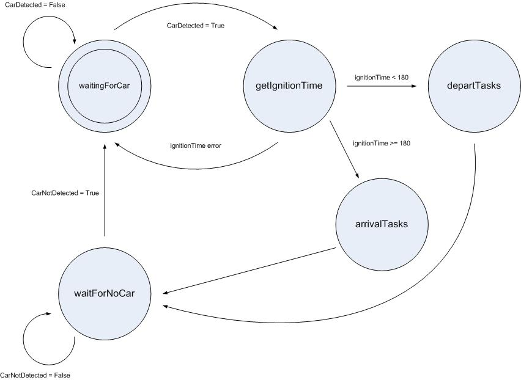
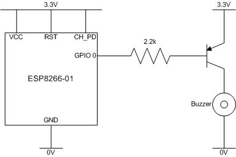

# IOT Car

## Intranet of Things Car

A Raspberry Pi in the house checks to see if the car ignition is on.  If the car ignition has been on for less than 180 seconds, the Raspberry Pi will perform some home automation "departure tasks".  If the car ignition has been on for more than 180 seconds, the Raspberry Pi will perform some home automation "arrival tasks".

The ESP8266-01 is intentionally dumb (the intelligence is built into the Raspberry Pi).  The ESP8266-01 will respond to pings and return the "uptime" (seconds car ignition has been on) in response to the following http requests:

* ipaddress/
* ipaddress/beep1
* ipaddress/beep2
* ipaddress/beep3

/beep*x* beeps the ESP8266-01 buzzer *x* times (*x*=1, 2 or 3).

## State Machine

## ESP8266-01 Circuit Diagram

## Dependencies
 
Requires transitions

pip install transitions

or clone from https://github.com/tyarkoni/transitions
